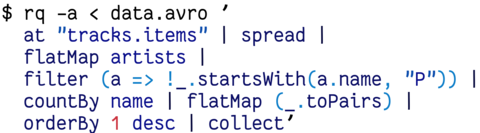

# `rq`   

**WARNING**: `rq` is in very low maintenance mode while I (@dflemstr) focus
on other things (such as my day job).  Pull requests are welcome but I won't
guarantee that I will fix reported issues.

This is the home of the tool called `rq` (record query).  It's a tool
that's used for performing queries on streams of records in various
formats.

The goal is to make ad-hoc exploration of data sets easy without
having to use more heavy-weight tools like SQL/MapReduce/custom
programs.  `rq` fills a similar niche as tools like `awk` or `sed`,
but works with structured (record) data instead of text.

It was created with love out of the best parts of Rust, C and
JavaScript, and is distributed as a dependency-free binary on many
operating systems and architectures.

## Quick links

  - [Installation](doc/installation.md) — How to install `rq`.
  - [Tutorial](doc/tutorial.md) — Learn `rq` from scratch.
  - [Process quick reference](https://dflemstr.github.io/rq/js/module-prelude.html)
    — Quickly find a process you need.
  - [Protobuf](doc/protobuf.md) — Configure Protobuf specifics.
  - [Development](CONTRIBUTING.md) — Contribute to `rq`.

## Platform support status

<table>
  <thead>
    <tr>
      <th rowspan="2">OS</th>
      <th colspan="2">Intel x86</th>
      <th colspan="3">ARM</th>
    </tr>
    <tr>
      <th>i686</th>
      <th>x86_64</th>
      <th>v6<a href="#user-content-foot1">1</a></th>
      <th>v6 HF<a href="#user-content-foot2">2</a></th>
      <th>v7<a href="#user-content-foot3">3</a></th>
    </tr>
  </thead>
  <tbody>
    <tr>
      <th>Linux <code>glibc</code><a href="#user-content-foot4">4</a></th>
      <td>
        
      </td>
      <td>
        
      </td>
      <td>
        
      </td>
      <td>
        
      </td>
      <td>
        
      </td>
    </tr>
    <tr>
      <th>Linux <code>musl</code><a href="#user-content-foot5">5</a></th>
      <td>
        
      </td>
      <td>
        
      </td>
      <td>
        
      </td>
      <td>
        
      </td>
      <td>
        
      </td>
    </tr>
    <tr>
      <th>Mac OS X</th>
      <td>
        
      </td>
      <td>
        
      </td>
      <td>
        &nbsp;
      </td>
      <td>
        &nbsp;
      </td>
      <td>
        &nbsp;
      </td>
    </tr>
  </tbody>
</table>

<a name="foot1">1</a> For example Raspberry Pi 1 (A and B) running Raspbian.  
<a name="foot2">2</a> For example Raspberry Pi 1 (A and B) running Arch Linux.  
<a name="foot3">3</a> For example Raspberry Pi 2+.  
<a name="foot4">4</a> Requires a recent version of `glibc`/`libstdc++`, so use musl if possible.  
<a name="foot5">5</a> Completely statically linked; only depends on a recent kernel version.

## Format support status

| Format                  | Read | Write |
|-------------------------|------|-------|
| Apache Avro             | ✔️    | ✔️     |
| CBOR                    | ✔️    | ✔️     |
| HJSON                   | ✔️    | ✔️     |
| JSON                    | ✔️    | ✔️     |
| MessagePack             | ✔️    | ✔️     |
| Google Protocol Buffers | ✔️    | ✖️     |
| YAML                    | ✔️    | ✔️     |
| TOML                    | ✔️    | ✔️     |
| Raw (plain text)        | ✔️    | ✔️     |
| CSV                     | ✔️    | ✔️     |
