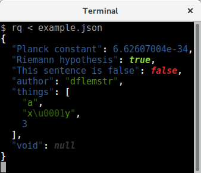

# Tutorial

This assumes that `rq` is installed.  See
[installation](installation.md) for more details on how to do that if
you want to follow along.

## Input/Output

`rq` reads record data from stdin, and writes transformed data to
stdout.  By default, it uses JSON for the input and output format, and
returns each input record unmodified:

    $ rq <<< 'null true {"a": 2.5}'
    null
    true
    {"a":2.5}

## Highlighting

This Markdown document doesn't do the `rq` output justice.  The output
of `rq` is actually very colorful!

## Record formats

You can configure the input and output formats to use with flags (see
`rq --help` for details).  A lower-case single-letter flag sets the
input format, and an upper-case single-letter flag sets the output
format.  For example, to read JSON and output CBOR, pass `-jC` and to
read CBOR and output JSON, pass `-cJ`.  This can be used to build a
not-very-useful conversion pipeline that round-trips to CBOR (maybe
you could pipe it through `gzip` and `ssh` in-between and it might be
worth it):

    $ (rq -jC | rq -cJ) <<< 'null true {"a": 2.5}'
    null
    true
    {"a":2.5}

Some format flags take an argument to configure them, for example
Google Protocol Buffers:

    $ rq protobuf add example.proto
    $ rq -p .example.Person < person.pb
    {"name":"John","age":34}

## Transforming records

`rq` can perform queries on the records it sees.  This is done by
running processes in a pipeline.

### Process anatomy

Processes can take arguments and are combined via the pipe `|`
operator.  This is very similar to how UNIX processes work.  That's
why it's useful to single-quote the process pipeline so that your
shell doesn't try to run it like regular UNIX processes.

    $ rq 'process1 arg1 arg2 | process2 arg1'

Processes are usually named in `camelCase` and were shamelessly taken
almost directly from for example [`lodash`][lodash].  If you can use
`_.foo(<array/collection>, <args>)` in `lodash`, it's pretty likely
that you can say `rq 'foo <args>'` in `rq`.

Process arguments can either be JSON values or lambdas.  Here are some
example arguments:

  - `"foo"` - The JSON string `"foo"`
  - `42` - The number 42
  - `{"a": 2, "b": 3}` - A JSON object
  - `[1, 2, 3]` - A JSON array
  - `foo` - A bare string that doesn't have any special characters,
    same as `"foo"`.
  - `(x) => {Math.floor(x)}` - A lambda that takes one argument and
    calls the JS `Math.floor` function.
  - `(x, y) => {x + y}` - A lambda that takes two arguments and adds
    them together.
  - `(x, y) => {_.isEqual(x, y)}` - A lambda that takes two arguments
    and calls the lodash `_.isEqual` function.

Arguments are dynamically typed, and processes that claim to take a
`function` argument usually support some short-hands:

  - `{"x": 2, "y": false}` - Short-hand for a function that matches
    the given object structure with its input.  This function returns
    `true` for objects that have an `x` field that is `2` and an `y`
    field that is `false`, and returns `false` otherwise.
  - `["x", 2]` - Short-hand for a function that matches objects that
    contain the given path.  This function returns `true` for objects
    whose `x` field have the value `2`, and returns `false` otherwise.
  - `[2, "foo"]` - Similar to above, this function matches arrays
    whose third element is `"foo"`.
  - `"x"` - Short-hand for a function that accesses a property.  Given
    the argument `{"x": 2}`, this function would return `2`.
  - `4` - Similar to above, this function returns the fifth element of
    an array.

### Useful processes

A full list of processes is available
[here](http://dflemstr.github.io/rq/js/global.html).  The most
commonly used processes are:

**Pass-through**

  - [`id`](http://dflemstr.github.io/rq/js/global.html#id)
    Passes through each input unmodified (this is the default process)
  - [`tee`](http://dflemstr.github.io/rq/js/global.html#tee)
    Like `id`, but logs each passed through value.  The arguments can
    be used to give the log lines a tag.

**Path traversal**

  - [`select`](http://dflemstr.github.io/rq/js/global.html#select)
    Selects values at a given path ([JSONPath][jsonpath] or
    [JSON Pointer][jsonpointer])
  - [`modify`](http://dflemstr.github.io/rq/js/global.html#modify)
    Takes a path and a function, and modifies each path target by the
    function.

**Compaction**

  - [`collect`](http://dflemstr.github.io/rq/js/global.html#collect)
    Collects all stream elements into an array.
  - [`spread`](http://dflemstr.github.io/rq/js/global.html#spread)
    Spreads each input array into separate stream elements.

**Filters**

  - [`filter`](http://dflemstr.github.io/rq/js/global.html#filter)
    Filters out elements that match a predicate.
  - [`reject`](http://dflemstr.github.io/rq/js/global.html#reject)
    Filters out elements that don't match a predicate.
  - [`every`](http://dflemstr.github.io/rq/js/global.html#every)
    Checks if a predicate holds for all input values.
  - [`some`](http://dflemstr.github.io/rq/js/global.html#some)
    Checks if a predicate holds for any input value.
  - [`find`](http://dflemstr.github.io/rq/js/global.html#find)
    Finds an input value that matches a predicate.

**Transformations**

  - [`map`](http://dflemstr.github.io/rq/js/global.html#map)
    Applies a function to each input element.
  - [`flatMap`](http://dflemstr.github.io/rq/js/global.html#flatMap)
    Applies a function to each input element, and flattens the
    resulting arrays.
  - [`uniq`](http://dflemstr.github.io/rq/js/global.html#uniq)
    Removes duplicates from the input stream.

**Aggregations**

  - [`groupBy`](http://dflemstr.github.io/rq/js/global.html#groupBy)
    Groups elements by a certain criterium.
  - [`countBy`](http://dflemstr.github.io/rq/js/global.html#countBy)
    Counts elements by a certain criterium.
  - [`keyBy`](http://dflemstr.github.io/rq/js/global.html#keyBy)
    Extracts a key to be used to group elements.
  - [`sortBy`](http://dflemstr.github.io/rq/js/global.html#sortBy)
    Sorts elements by the results of a number of functions.
  - [`orderBy`](http://dflemstr.github.io/rq/js/global.html#orderBy)
    Orders elements by a list of functions and explicit orderings.

**Slices**

  - [`drop`](http://dflemstr.github.io/rq/js/global.html#drop)
    Drop the specified number of elements from the input.
  - [`dropWhile`](http://dflemstr.github.io/rq/js/global.html#dropWhile)
    Drop elements while the specified predicate holds.
  - [`take`](http://dflemstr.github.io/rq/js/global.html#take)
    Take the specified number of elements from the input.
  - [`takeWhile`](http://dflemstr.github.io/rq/js/global.html#takeWhile)
    Take elements while the specified predicate holds.
  - [`slice`](http://dflemstr.github.io/rq/js/global.html#slice)
    Slice the input stream by indices.
  - [`nth`](http://dflemstr.github.io/rq/js/global.html#nth)
    Only keep the nth element.

**Reductions**

  - [`join`](http://dflemstr.github.io/rq/js/global.html#join)
    Join the input by a separator.
  - [`max` / `maxBy`](http://dflemstr.github.io/rq/js/global.html#max)
    Find the maximum of the input.
  - [`mean` / `meanBy`](http://dflemstr.github.io/rq/js/global.html#mean)
    Find the mean of the input.
  - [`min` / `minBy`](http://dflemstr.github.io/rq/js/global.html#min)
    Find the minimum of the input.
  - [`sum` / `sumBy`](http://dflemstr.github.io/rq/js/global.html#sum)
    Sum the input.
  - [`reduce`](http://dflemstr.github.io/rq/js/global.html#reduce)
    Run a custom reduction.

[lodash]: https://lodash.com/
[jsonpath]: http://goessner.net/articles/JsonPath/
[jsonpointer]: https://tools.ietf.org/html/rfc6901
